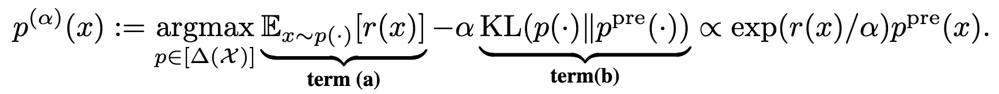
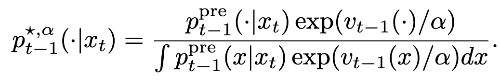
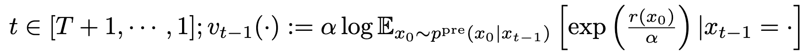
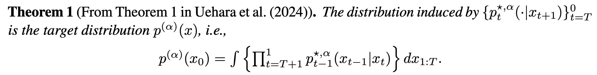
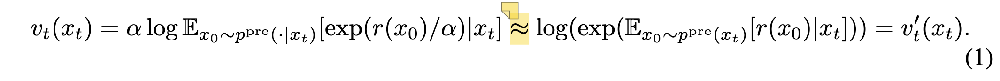
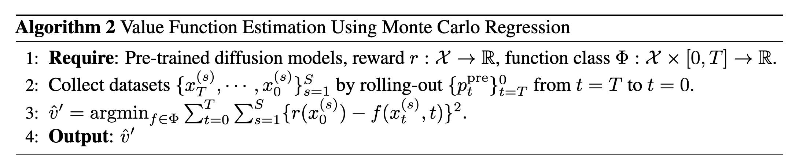
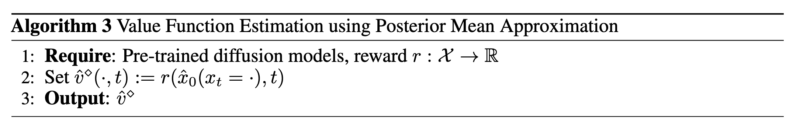
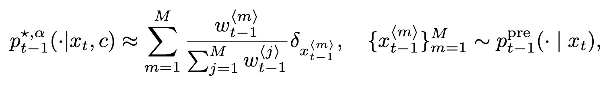
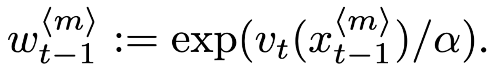
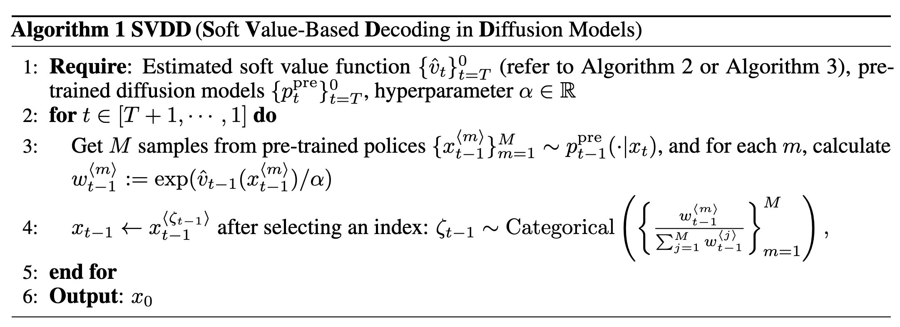

### Motivation

<a href="zotero://open/library/items/DDADDQMF?page=1">“Rather than merely generating designs that are natural, we aim to optimize downstream reward functions while preserving the naturalness of these design spaces.”</a> (<a href="zotero://select/library/items/86FSSFV8">Li et al., 2024, p. 1</a>)

<a href="zotero://open/library/items/DDADDQMF?page=1">“Existing methods for achieving this goal often require “differentiable” proxy models (e.g., classifier guidance) or computationally-expensive fine-tuning of diffusion models (e.g., classifier-free guidance, RL-based fine-tuning).”</a> (<a href="zotero://select/library/items/86FSSFV8">Li et al., 2024, p. 1</a>)

### Method

采样目标：

定义采样过程：

Value function：

1）soft-value function

一种是训练：

其中采用了如下近似，

事实上是下界，<a href="zotero://open/library/items/DDADDQMF?page=6">“However, when α is very small, the scaling of exp(r(·)/α) tends to be excessively large.”</a> (<a href="zotero://select/library/items/86FSSFV8">Li et al., 2024, p. 6</a>)，为避免这个问题emprically的做法。

另一种是直接用模型预测的$\hat{x}_0$：

2\) 采样$p_{t-1}^{\star,\alpha}$

采用importance sampling

