### Motivation

<a href="zotero://open/library/items/UFL8A6I6?page=1">“Diffusion models provide powerful data priors that can solve linear inverse problems in zero shot through Bayesian posterior sampling. However, exact posterior sampling for diffusion models is intractable. Current solutions often hinge on approximations that are either computationally expensive or lack strong theoretical guarantees.”</a> (<a href="zotero://select/library/items/BDG9PZNF">Dou and Song, 2023, p. 1</a>)

### Method

*   Linear Inverse Problems

Given a datapoint x, its lossy measurement is denoted as

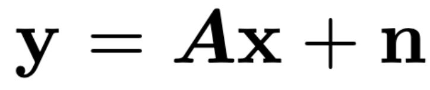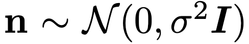

*   Bayesian filtering

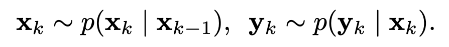

The Bayesian filtering problem seeks to sample from the distribution $p(x_k | y_{1:k})$. Starting with the known prior distribution $p(x_0)$,

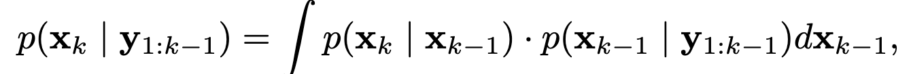

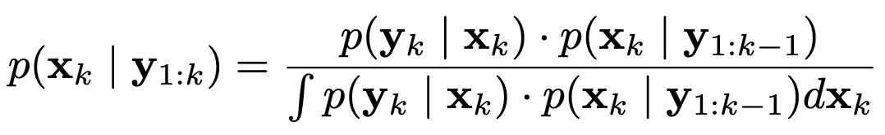

By iterating these two steps, we can solve the Bayesian filtering problem.

*   Filtering Posterior Sampling (FPS)

In diffusion posterior sampling problem,\
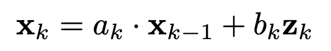

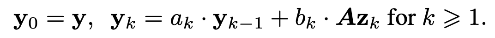

Given $y ∼ N (Ax_0, σ^2I)$, it is easy to show that $y_k ∼ N (Ax_k, c^2_kσ^2I)$ for $c_k = a_1a_2 . . . a_k$.

Or generating $\{y_k\}$ from the backward process,

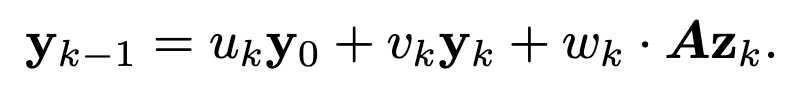

where $u_k$, $v_k$, $w_k$ can be computed from $a_k$, $b_k$, and the initial observation $y_N$ approximately follows $N (0, AA^⊤)$.

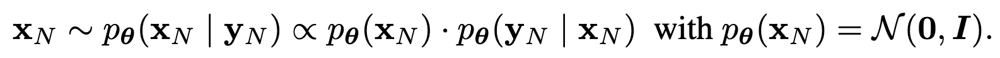

Since $p_θ(y_k | x_k) ∼ N (Ax_k, c^2_kσ^2I)$ and

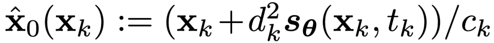

we can get the posterior distribution,

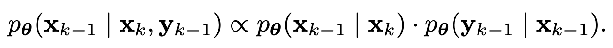

<a href="zotero://open/library/items/UFL8A6I6?page=6">“To improve the approximation made by FPS, we propose a variant based on particle filtering and sequential Monte Carlo.”</a> (<a href="zotero://select/library/items/BDG9PZNF">Dou and Song, 2023, p. 6</a>)

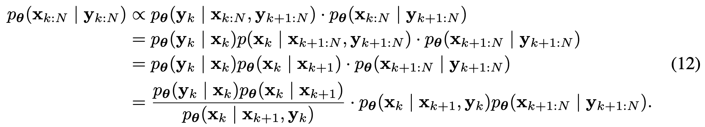

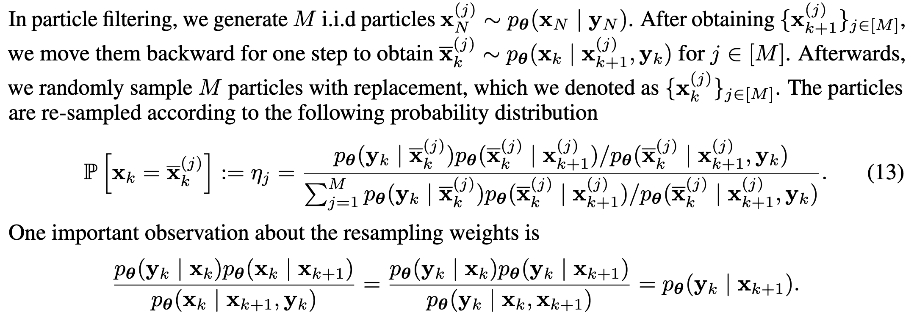

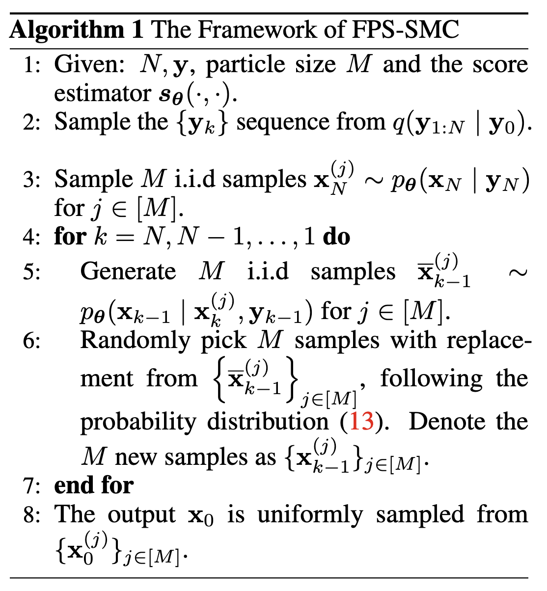
