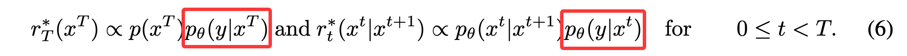
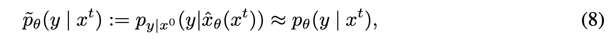
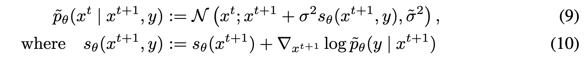
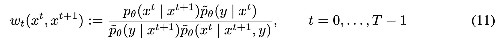
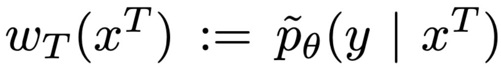

### Motivation

<a href="zotero://open/library/items/FGKV5VE8?page=1">“However, these achievements have primarily depended on task-specific conditional training or error-prone heuristic approximations.”</a> (<a href="zotero://select/library/items/J3X9V429">Wu et al., 2024, p. 1</a>)

*   **特定于任务的条件训练:** 需要为每个新的条件类型重新训练模型，成本高昂且不灵活。
*   **启发式近似方法:** 这些方法虽然灵活，可以直接用于预训练的无条件模型，但其近似的准确性未知，可能导致与条件不符或与模型先验不符的结果，尤其在需要高精度的领域（如分子设计）中存在风险。

### Method

*   twisting:

由于$p_\theta(y|x^t)$ intractable，用DM估计的$x^0$近似，

类似classifier guidance，需要计算梯度，因此twisting functions需要differentiable；得到proposals如下，

*   weighting functions

Because $\tilde{p}_θ(x^t | x^{t+1}, y)$ will not in general coincide with the optimal twisted proposal $p_θ(x^t | x^{t+1})$, we must introduce non-trivial weighting functions to ensure the resulting SMC sampler converges to the desired final target.

### Experiments

*   二维模拟
*   条件图像生成
*   蛋白质 motif-scaffolding problem
