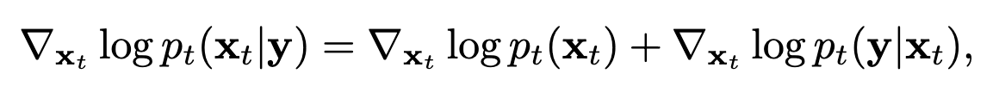
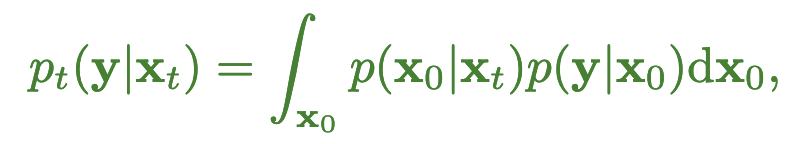
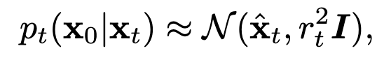
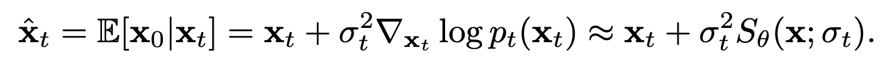
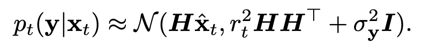
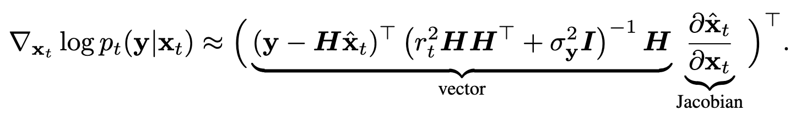
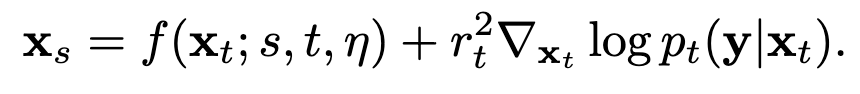

### Motivation

<a href="zotero://open/library/items/U4F7LKFQ?page=1">“Models trained for specific inverse problems work well but are limited to their particular use cases, whereas methods that use problem-agnostic models are general but often perform worse empirically.”</a> (<a href="zotero://select/library/items/NQ9RQ6SI">Song et al., 2022, p. 1</a>)

### Method

*   Linear Inverse Problems

其中，$z ∼ N (0, σ^2_yI)$

*   Score function

The problem-specific score can be decomposed via Bayes’ rule:

We first approximate $p_t(x_0|x_t)$ with the following Gaussian:

$r_t$ is a timedependent standard deviation value that should depend on the data.

Thus, we have the following approximation to the score:

*   Adaptive weighting

<a href="zotero://open/library/items/U4F7LKFQ?page=5">“unlike most existing methods that apply a fixed weight for different diffusion times, we introduce a heuristic that implicitly adapts the guidance weights according to the timestep”</a> (<a href="zotero://select/library/items/NQ9RQ6SI">Song et al., 2022, p. 5</a>)

