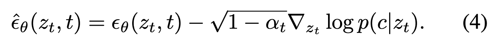
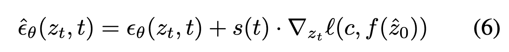
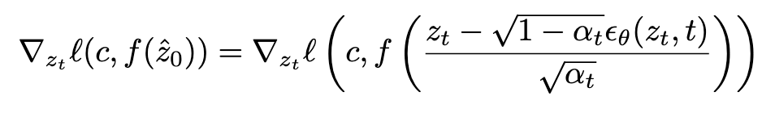
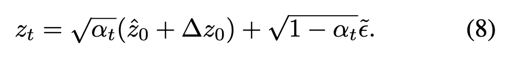
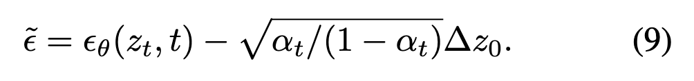
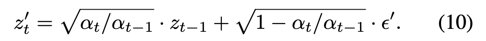

### Motivation

<a href="zotero://open/library/items/HERCSMV6?page=1">“Typical diffusion models are trained to accept a particular form of conditioning, most commonly text, and cannot be conditioned on other modalities without retraining.”</a> (<a href="zotero://select/library/items/EKHPN4MY">Bansal et al., 2023, p. 1</a>)

### Method

*   forward universal guidance

根据classifier guidance的做法，

将其改写，使得能够接受通用的指导函数和损失函数。

<a href="zotero://open/library/items/HERCSMV6?page=4">“directly replacing f_cl and l_ce with any off-theshelf guidance and loss functions does not work in practice, as f is most likely trained on clean images and fails to provide meaningful guidance when the input is noisy.”</a> (<a href="zotero://select/library/items/EKHPN4MY">Bansal et al., 2023, p. 4</a>)

因此采用每一步预测的$\hat{Z}_0$代替$Z_t$，

*   backward universal guidance

<a href="zotero://open/library/items/HERCSMV6?page=4">“we observe that forward guidance sometimes over-prioritizes maintaining the “realness” of the image, resulting in an unsatisfactory match with the given prompt. Simply increasing the guidance strength s(t) is suboptimal, as this often results in instability as the image moves off the manifold faster than the denoiser can correct it.”</a> (<a href="zotero://select/library/items/EKHPN4MY">Bansal et al., 2023, p. 4</a>)

<a href="zotero://open/library/items/HERCSMV6?page=4">“The key idea of backward guidance is to optimize for a clean image that best matches the prompt based on z_0, and linearly translate the guided change back to the noisy image space at step t.”</a> (<a href="zotero://select/library/items/EKHPN4MY">Bansal et al., 2023, p. 4</a>)

*   Per-step Self-recurrence

<a href="zotero://open/library/items/HERCSMV6?page=4">“Unfortunately, when we apply our universal guidance to standard generation pipelines, we often find images with artifacts and strange behaviors that clearly separate them from natural images.”</a> (<a href="zotero://select/library/items/EKHPN4MY">Bansal et al., 2023, p. 4</a>)

在采样$Z_{t-1}$之后，再进行加噪，重复k次，其中$\epsilon' \sim \mathcal{N}(0, \mathbf{I})$，

### Experiments

只有定性实验。

*   Stable Diffusion

    *   CLIP Guidance
    *   Segmentation Map Guidance
    *   Face Recognition Guidance
    *   Object Location Guidance
    *   Style Guidance

*   ImageNet Diffusion

    *   CLIP Guidance
    *   Object Location Guidance
    *   Segmentation-Guided Inpainting
